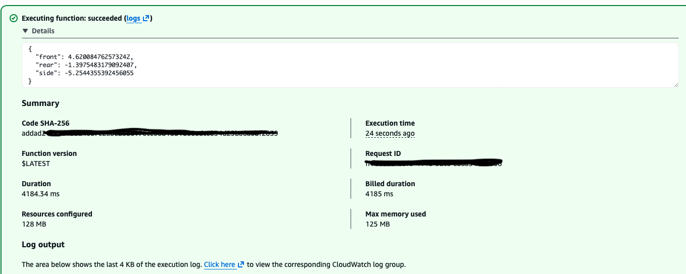
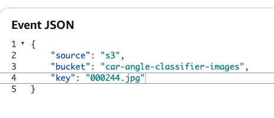

# Car-Angle-Classifier
## Project Description
This project builds an image classification system to determine the viewing angle of a vehicle from a single image.
Given an input image, the model classifies it into one of three categories:
- Front view
- Rear view
- Side view
### Motivation
Identifying car models from images is challenging due to:
A large number of car models
High visual similarity between different models
Sensitivity to viewing angle
To simplify the problem, the pipeline is split into three steps:
- Car logo detection (YOLO)
- Car angle classification (**this project**)
- Car model classification
Knowing the car make and viewing angle reduces the complexity of model classification.

## Data Collection & EDA
### Data Collection

Images were downloaded using **DuckDuckGo** search queries corresponding to class labels (front/rear/side).  

Process:

- Manual review to remove incorrect images  
- Images and metadata stored in **Google Drive** for easy Colab access  

📂 **Dataset**:  
[Google Drive Link](https://drive.google.com/drive/folders/12QVVb5izerFxFGUyt6o_4DDtoyvDIPMo?usp=sharing)

### Exploratory Data Analysis (EDA)

EDA focused on:

- Label correctness  
- Removing corrupted or invalid images  
- Class balance  

After cleaning, data was split using `sklearn.train_test_split`:

| Class | Training Count |
|-------|----------------|
| Front | 272 |
| Rear  | 203 |
| Side  | 238 |

📓 **EDA & Data Split Notebook**:  
`data/split_data.ipynb`

## training
### Architecture

- Base: **MobileNetV2** (pretrained)  
- Transfer learning with frozen base layers  
- Custom classification head  
- Experiments included: data augmentation, dropout, and inner layer modifications

### Training Experiments

| Attempt | Description | Epochs | Best Validation Accuracy |
|---------|------------|--------|------------------------|
| 1 | Baseline | 10 | 0.8521 |
| 2 | More augmentation | 10 | 0.8239 |
| 3 | Reduced augmentation (continued training) | 10 | 0.8380 |
| 4 | Dropout + inner layer | 50 | 0.8590 |

- Learning rate was kept constant  
- Best model exported to **ONNX** for deployment

### Training Steps:
1, download images to google drive, mount google drive to google colab.   
2, run training/car_angle_classifier_training.ipynb.  
3, save the final model locally.   

### Enviroment
I trained model in google colab, which handles environments and dependencies. 
i have a package list in training/requirements.txt.  

## Deploy Locally
onnx model is deployed with lambda function.     
### Build and Run Docker Image
```
docker build -t car-angle-classifier .
docker run -it --rm \
    -p 8080:8080 \
    car-angle-classifier
```
note: have aws configure first.   
if not configured, s3 source is not possible to reach.   
```
docker run -it --rm \
    -p 8080:8080 \
    -v ~/.aws:/root/.aws:ro
    car-angle-classifier
```
### test locally
open another terminal, python test.py.  


## Cloud Deployment 
### API Gateway Endpoint: 
https://w5za34is7b.execute-api.us-east-2.amazonaws.com

### Test with S3 Image
run with test images from my s3 bucket.   
note: test id is in file data/labels_fixed.csv.  
if the id is not found in my s3 bucket, you will get a 'NoSuchKey' error.   




```
curl -X POST \
  https://w5za34is7b.execute-api.us-east-2.amazonaws.com/predict \
  -H "Content-Type: application/json" \
  -d '{
    "source": "s3",
    "bucket": "car-angle-classifier-images",
    "key": "000291.jpg"
  }'
  ```
### Test with image URL
try images in url, change the url with a image of a car.   
note: the image should only contain full view of one car, in any angle.    

```
curl -X POST \
  https://w5za34is7b.execute-api.us-east-2.amazonaws.com/predict \
  -H "Content-Type: application/json" \
  -d '{
    "url": "https://media.wired.com/photos/5e7b7a0fadfa9d0008e095b2/master/w_2560%2Cc_limit/Transpo-selfdrivingcar-1158000221.jpg"
  }'
```

### bash command
`chmod +x deploy.sh`
`./deploy.sh`

## Next Steps
### Improve Dataset
- Collect more images for better generalization
- Reduce class imbalance
- Add harder examples

### Improve lambda function
- prefer direct image urls over s3 logic
- add input validation and error handling
- gracefully handle malformed requests

### integrate with car make classifier
Logo detection -> angle classifier -> model classifier

